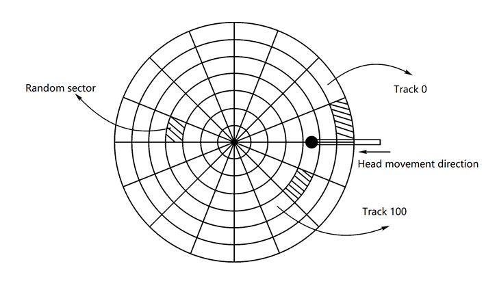

## Question 1

1. I/O control methods can be classified as (1)(2).
2. Each physical record on the disk has a unique address that consists of three parts: (1)(2)(3).
3. Data READ/WRITE time = (1)(2)(3).
4. The metric for measuring I/O performance are (1)(2).

1) (1) Programmed (2) DMA
2) (1) Head identifier (2) Track identifier (3) Sector identifier
3) (1) Seek time (2) Rotational latency (3) Transfer Time
4) (1) Response time (2) Throughput

## Question 2

What are the work steps of the DMA controller? Please answer it and briefly describe the process of each step

1. Preparation. When a device is requiring writing data, CPU will set the address register and the data counter register in the DMA controller, and set the interrupt bit and busy bit in the DMA controller.
2. Waiting. The device is waiting for CPU to distribute CPU resources to idle it.
3. Working. The device will consume CPU resources to store the data until it is done.
4. Finish. Once input is over, the DMA controller will send a interrupt signal.

## Question 3

Under what circumstance, the SSTF algorithm will cause starvation?

If sectors near the head is visiting continuously, the further sectors will not be visited in a long time in the SSTF algorithm, which causes starvation.

## Question 4

Suppose the computer system uses the disk as the following:

Let a single-sided disk rotation speed be 12000r/min, each track has 100 sectors, 200 tracks in total, and the average movement time between adjacent tracks is 1 ms.

If at some point, the head is located at track 100 and moves in the direction in which the track number increases, the track number request queue is 70, 90, 30, 120, 20, 60. For each track in the request queue, a randomly distributed sector is read.

1. If the C-SCAN algorithm is used to read the six sectors,
   1. Write the track access sequence (5 points)
   2. How much time is required in total? The calculation process is required. (15 points).
2. If using SSD, which scheduling algorithm do you think should be used, and explain why? (10 points)

1) If the C-SCAN algorithm is used to read the six sectors, the track sequence is 100, 120, 199, 0, 20, 30, 60, 70, 90. Time required in total is 388. (388 = 120 - 100 + 199 - 120 + 199 - 0 + 20 - 0 + 30 - 20 + 60 - 30 + 70 - 60 + 90 - 70)
2) SSD has no rotational latency and low seek time, so request sequence does not that much matter when using SSD. In that situation, I think FIFO is the best algorithm because it can read/write data as soon as possible and it is very simple and efficient.
