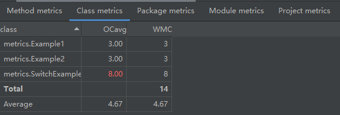
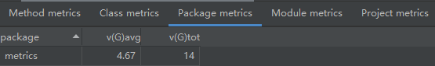
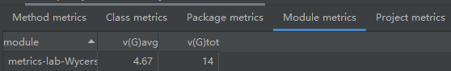
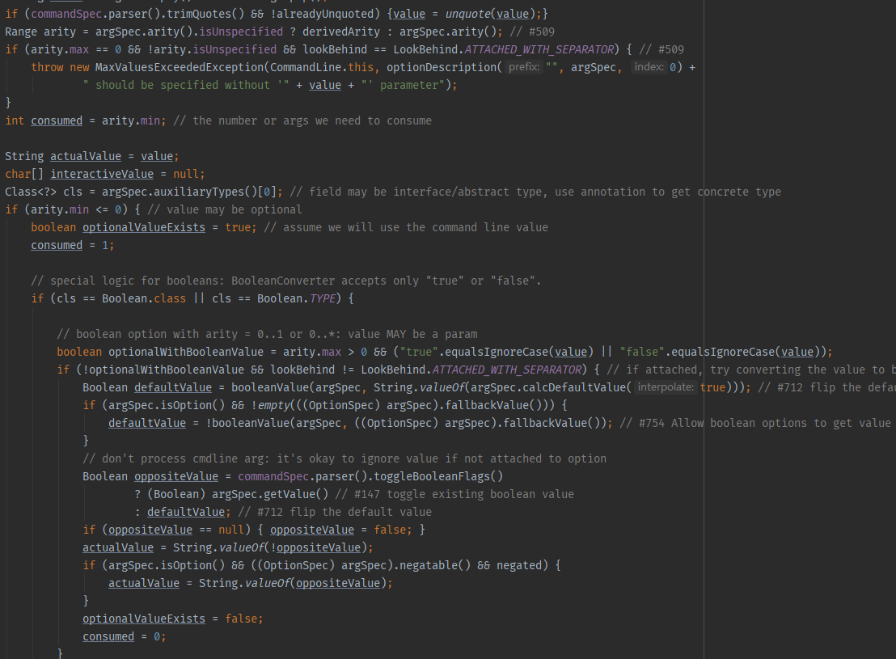

# Metrics lab

## Information

Name: 吴烨昌

Student ID: 11711918

## Part 1

### Method metrics

### Class metrics

### Package metrics

### Module metrics

### Project metrics

## Part 2

### What is the Lines of Codes of your selected project? (If you selected two projects, you just need to select one of the projects to answer this question)

71310 LOC.

### What is the maximum Cyclomatic Complexity of the classes of your project?

10.00(But I'm not sure OC is equvalent to CC or not)

### Do your project has any method with cyclomatic complexity >10? If yes, explain why the cyclomatic complexity is high for your project.

Quite a lot..

The highest file has multiple condition instruction with complex condition. So the CC is so high.

