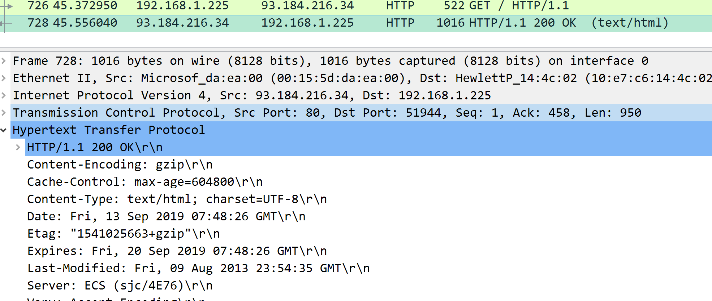
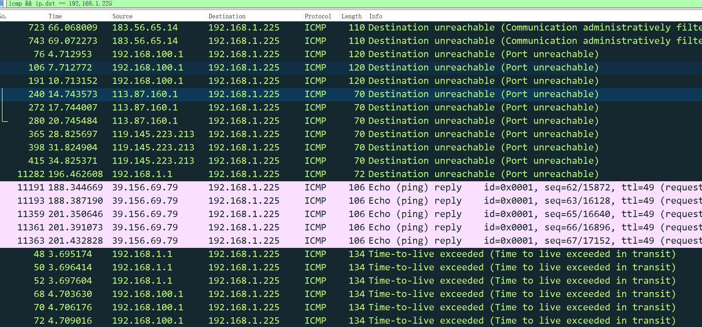

# Assignment2 for CS305

## Some info...

Author: 11711918 吴烨昌

Network environment of test machine:  two network interfaces:

1. Wired connection to a router. Its IP address is 192.168.1.225.
2. Wireless connection to campus network. Its IP address is 10.21.52.67.

## Problem 2.2

Use Wireshark to capture packets and answer the questions with your screenshots:

1. Open http://example.com in your browser, what kind of display filter do you need to filter out HTTP packets?

    

    use `http` to filter out HTTP packets.

2. How many layers do you see in the HTTP request packet? What’s the src ip addr, src port, dst ip addr and dst port of the request packet?

    
    
    Five layers in the HTTP request packet.
    
    ||Src|Dst|
    |:-:|:-:|:-:|
    |IP|`192.168.1.225`|51944|
    |Port|`93.184.216.34`|80|

3. What kind of information can be found in the HTTP response packet? Is there anything same with the information which is displayed on your browser?

    

    

    Content-header and Content-body can be found.

    Content-body is the source code of the web page in browser.

## Problem 2.3

Use Wireshark to capture packets and answer those questions with your screenshots (both Wireshark and tracert display):

1. Using a proper capture filter/display filter to capture/display a tracert traffic. And start tracert baidu.com.

    

    Use `icmp` to filter out tracert traffic.

2. How many packets did tracert send for each hop?

    

    Three packets for each hop.

3. How many kinds of response did tracert receive from the remote? What’s the source IP address of these response message?

    

    Four kinds of response.

    |Kind|source IP|
    |:-|:-:|
    | Destination unreachable (Communication administratively filtered)|`183.56.65.14`|
    | Destination unreachable (Port unreachable)|`192.168.100.1`, `113.87.160.1`, `119.145.223.213`|
    | Echo (ping) reply|`39.156.69.79`|
    | Time-to-live exceeded (Time to live exceeded in transit)|`192.168.1.1`,`192.168.100.1`， `113.87.160.1`,`119.145.223.213`, ...|

4. Try to calculate the RTT (round-trip time) between your host and baidu.com based on your capture instead of tracert display. Are they same with tracert display?

    

    We can calculate the RTT between host to badiu.com is $ (.432828 + .391074 + .350646 - .392244 - .352422 - .311325) / 3 = .039519$ (around 40ms). Same with tracert display.

## Summary

1. Use protocol name as filter such as `http` or `icmp` to filter out all packets with specific protocol.

2. Use `ip.src == xxx` or `ip.dst == xxx` to specify source or destination of packets.
