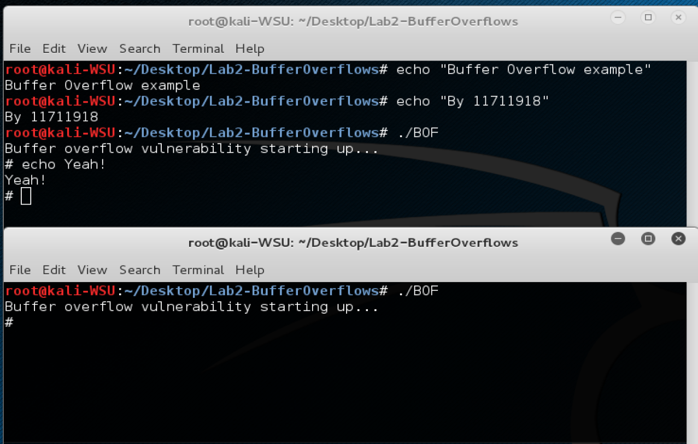

# Lab2 for CS315

## Some info...

Author: 11711918 吴烨昌

## Answers

1.  Your updated createBadfile.c that generates the input for the BOF program

    Attached

2.  A copy of the badfile. This must gengerate a shell when BOF runs from the
    command line in the VM

    Attached

3.  A screenshot of using BOF program to gain a shell (see simple screenshot
    below)

    Attached
    

4.  A text file with answers to the following questions:
    a. What happens when you compile without “-z execstack”?

    The following command will be executed.

    ```bash
    gcc -g -fno-stack-protector BOF.c -o BOF
    ```

    Of course the compliation will finish normally.

    But when executing the BOF (`./BOF`), the process will exit with the a segment fault error.

    b. What happens if you enable ASLR? Does the return address change?

    The base address of the heap and stack will be randomized.

    The return address will be changed.

    c. Does the address of the buffer[] in memory change when you run BOF using GDB, /home/root/Desktop/Lab2-BufferOverflows/BOF, and ./BOF?

    They will be different because of different stack.

    According to the experiment:

    I modify the `BOF.c` and make it output the address of the `buffer`.

    The results of three execution:

    

    

    The three addresses are `bffff214`, `bffff1b4`, `bffff1d4`.
