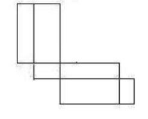

# Problem F: Beautiful pairs

## 题意

给出一个长度不超过 $10000$ 的字符串，选择某些字母变成大写，问最多有多少对相邻字母满足一大写一小写且均为辅音（除a e i o u w y）。

## 题解

### 直观做法

考虑到辅音字母只有19种，所有字母的大小写的情况只有 $2^{19}$ 种。那么可以枚举完所有情况后扫一遍字符串统计答案取最大值。

该做法的复杂度为 $O(2^{19} \times 10000)$，在10s的时限下可能可以卡过。

### 优化

观察到合法的相邻情况其实最多才 $19 \times 19$ 种，在长度为 $10000$ 的字符串中，一定存在大量相同的相邻对重复出现多次，那不妨预处理这个字符串中某一相邻对的出现对数。（二维数组`a[x][y]`表示`(x, y)`这样的合法相邻对出现的次数，若字符串中辅音x与辅音y相邻，则`a[x][y]++, a[y][x]++`）

统计答案的方法如下：将x变成大写的时候，对于所有辅音y，`ans += a[x][y]`。

但是要注意防止重复统计，因为如果x变成大写之后，又将某个辅音y变成大写的话，其实`a[x][y]`的部分就不能计入答案了，此时需要`ans -= a[y][x]`。

优化后的复杂度为 $O( 19^2 + 2^{19} \times 19)$，可以以比较优秀的时间通过这道题。

# Problem G: Box

## 题意

问一个能否用尺寸为 $n \times m$ 的纸板裁出一个尺寸为 $a \times b \times c$ 的盒子的展开图。

## 题解

由观察可得，最优解只有三种情况：

1. 利用1-3-1-1分解，长度为 $2*(b+c)$，宽度为 $a + 2 * min(b, c)$。
	
	

2. 利用1-1-2-1-1分解，长度为 $3 * a + b + c$，宽度为 $a + b$。

   

3. 利用1-2-2-1分解，长度为$ 2 * a + b + c$，宽度为 $min(a, c) + b + c$

   

保险起见，可以将长宽高的六种排列填入a, b, c，有一种满足即可。
