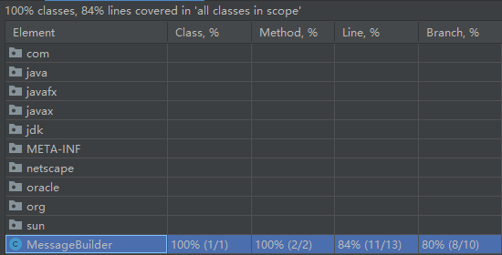

# coverage-lab

My student id is: 11711918

# Answers to questions

1.  How many percentage of Line Coverage the automated test
    achieve?

        84% according to Branch column of the picture.

2.  How many percentage of Branch Coverage the automated test
    achieve?

        80% according to Branch column of the picture.

3.  For each test, answer the following questions: 1. Which line will this test cover? 2. Rename each test to the line where each test cover

    Finished. [Link](https://github.com/cs304-fall2020/coverage-lab-Wycers/commit/3acf18442c6948a403457db672d6902cb986380d)

4.  Could Evosuite achieve 100% line coverage?

    - Maybe for some simple applications with more evaluating time.

    - Maybe never for some complex applications.

    - Never for dead codes.

5.  For each uncovered block of code, explain why the tool cannot cover.

    Line 12 (as follows) is not covered because no test inputs "cs".
    `result.append("Hello World");`

    Line 12 (as follows) is not covered because condition in line 16 never be true.
    `16: if (!name.equals(name)) { 17: result.append("Bye"); 18: }`

6.  Write more tests to increase the code coverage

    No way because length of string "cs" is smaller than 4 and `!name.equals(name)` is always `false`.
