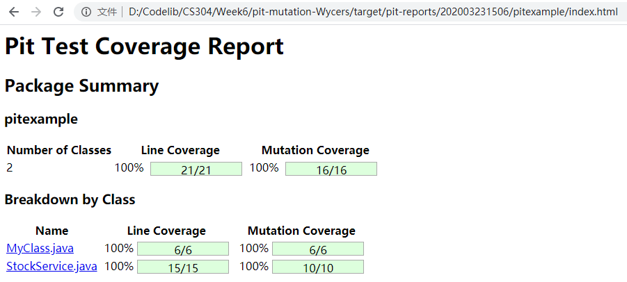

PIT Example
===========

Example of running [PIT](http://pitest.org/) mutation testing tool using
[JUnit](http://www.junit.org/)

## Information

Name: 吴烨昌

Student ID: 11711918

Running
-------

This example uses [Maven](http://maven.apache.org/), a project management
tool that neatly takes care of dependencies.

To run the mutation tests, execute the following commands

    mvn clean install                              #clean and compile
    mvn test                                       #run jUnit
    mvn org.pitest:pitest-maven:mutationCoverage   #run PIT mutation tests

If Maven is not available on your system, there is a provided ant script.

    ant
    ant test
    ant pit

If you prefer to run PIT directly via the command line, run the following:

    java -cp target/classes:target/test-classes:lib/junit-4.10.jar:lib/pitest-0.25-SNAPSHOT.jar \
        org.pitest.mutationtest.MutationCoverageReport \
        --reportDir target/pit-reports \
        --targetClasses pitexample.* \
        --sourceDirs src/main/java,src/test/java

and see the generated report in target/pit-reports.

Examining the output
--------------------

The example has the following method

    public boolean myMethod(int a, boolean flag) {
        if (a > 0) {
            return true;
        }
        if (flag) {
            return true;
        }
        return false;
    }

That is tested with the following:

    @Test public void testMe() {
      MyClass sut = new MyClass();
      assertTrue(sut.myMethod(1, true));
      assertTrue(sut.myMethod(2, true));
      assertTrue(sut.myMethod(1, false));
      assertTrue(sut.myMethod(2, false));
      assertFalse(sut.myMethod(0, false));
    }

The output from PIT indicates that it created 6 mutations, and only killed
5 of them (83%). Looking at the html output, it becomes clear that there is
another assertion missing. Adding the following assertion and rerunning will
complete the test.

    assertTrue(sut.myMethod(0, true));

Integrating with an existing system
-----------------------------------

It is imperative that you compile all code with debug information. This means
that you must add `debug="true"` to the javac blocks in your ant file.
