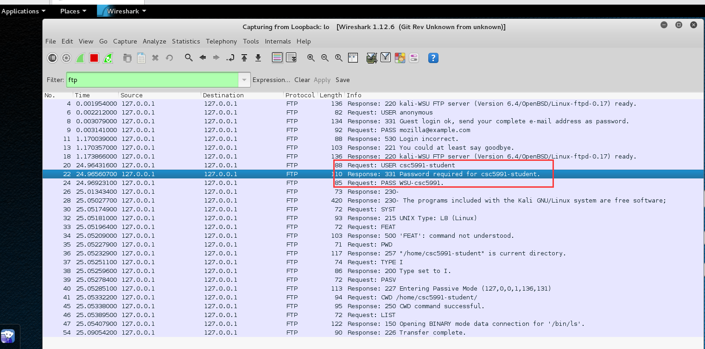

# Lab1 for CS315

## Some info...

Author: 11711918 吴烨昌

## Answers

1. Carefully read the lab instructions and finish all tasks above.

   pass

2. If a packet is highlighted by black, what does it mean for the packet?

   1. Bad TCP
   2. HSRP Stat
   3. Spanning T
   4. OSPF Stat
   5. ICMP error
   6. Checksum fail

3. What is the filter command for listing all outgoing http traffic?

   `http.request`

4. Why does DNS use Follow UDP Stream while HTTP use Follow TCP Stream?

   1. TCP has large overhead than UDP.
   2. In general, DNS request has a smaller transmission size than HTTP.
   3. In general, DNS response will be cached.
   4. In general, a single DNS query may lead to a lot of DNS recusive requests.

   So, it's expensive to use TCP to send DNS requests (DNS requests is small and doesn't require high stability). So DNS use Follow UDP Stream.

   For HTTP requests, the transmission size is large. The overhead is not so bad in this situation. And it needs more stable connection to reduce error. So HTTP use Follow TCP Stream.

5. Using Wireshark to capture the FTP password.

> There is a FTP server installed on the Kali Linux VM. You need to use a terminal
> to log into the server and use Wireshark to capture the password. The username
> for the FTP server is csc5991-student, and the password is [WSU-csc5991.]
> without the brackets. You will user the username and password to login the FTP
> server while Wireshark is running. Note that the FTP server is installed on the
> localhost, make sure you select the right interface for the capturing. You need to
> explain to me how you find the password and a screenshot of the password
> packet. Have fun!

