# Lab11 for CS315

## Some info...

Author: 11711918 吴烨昌

## Tasks

### Task 1: Posting a Malicious Message to Display an Alert Window

After that, when anybody visits Alice's profile, the alert popups.

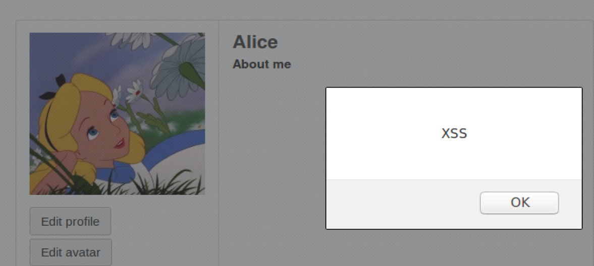

### Task 2: Posting a Malicious Message to Display Cookies

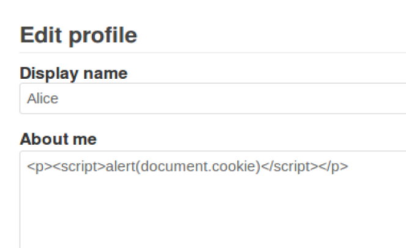

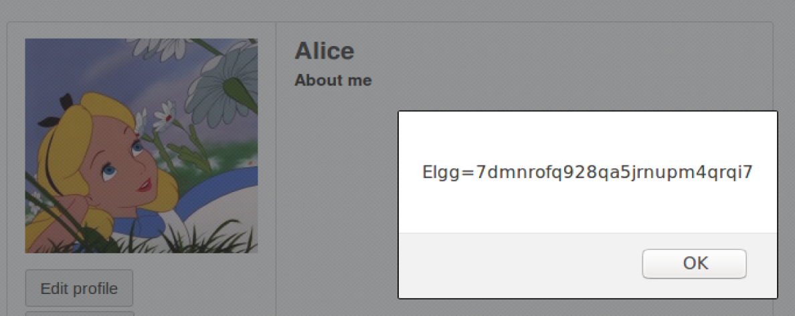

### Task 3: Stealing Cookies from the Victim’s Machine

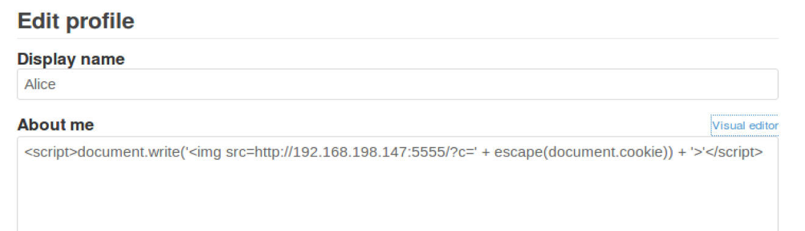

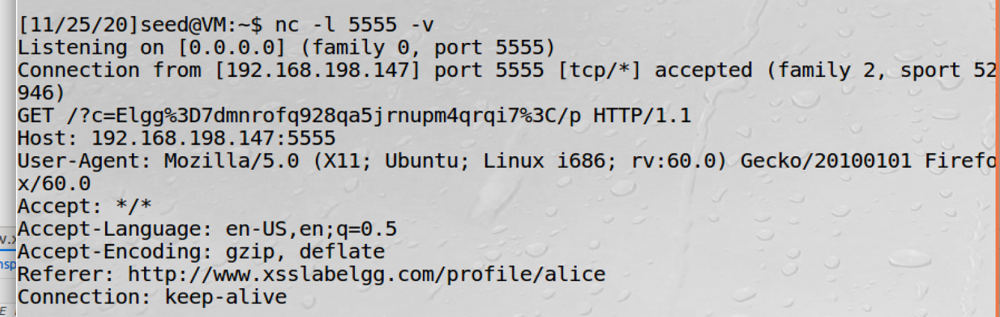

### Task 4: Becoming the Victim’s Friend

Alice edit her profile as follows:

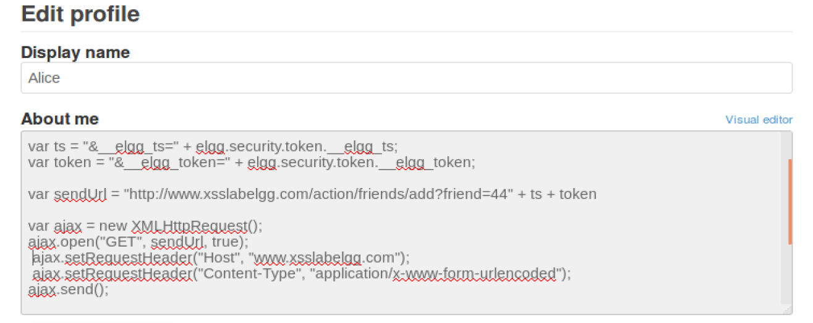

​	After victim Boby visits Alice's profile, he becomes a friend of Alice:

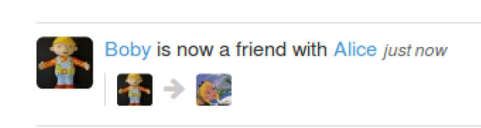 

#### Questions. Please answer the following questions: 

 - Question 1: Explain the purpose of Lines ➀ and ➁, why are they are needed? 

   1. ts is timestamp, which is used by server to prevent replay attack. Provide this field to cheat server that it's a normal request.
   2. token is used by server to identify user. Provide this  field to cheat server that it's a normal request from current user.

 - Question 2: If the Elgg application only provide the Editor mode for the "About Me" field, i.e., you cannot switch to the Text mode, can you still launch a successful attack?

   Observe that saving profile action makes POST request to `/action/profile/edit`, we can construct such a request to freely modify fileds.

   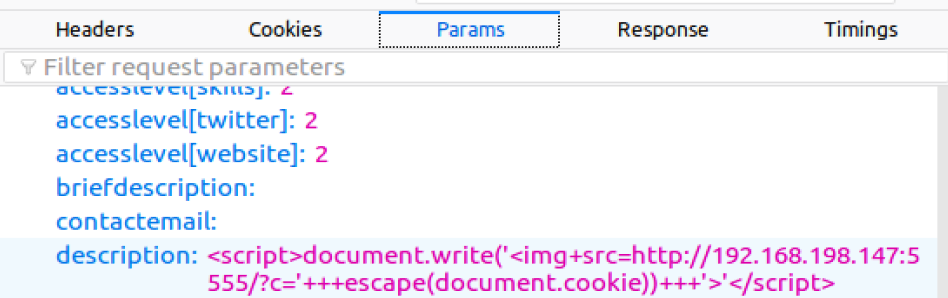

### Task 5: Modifying the Victim’s Profile

Alice sets her profile as follows:

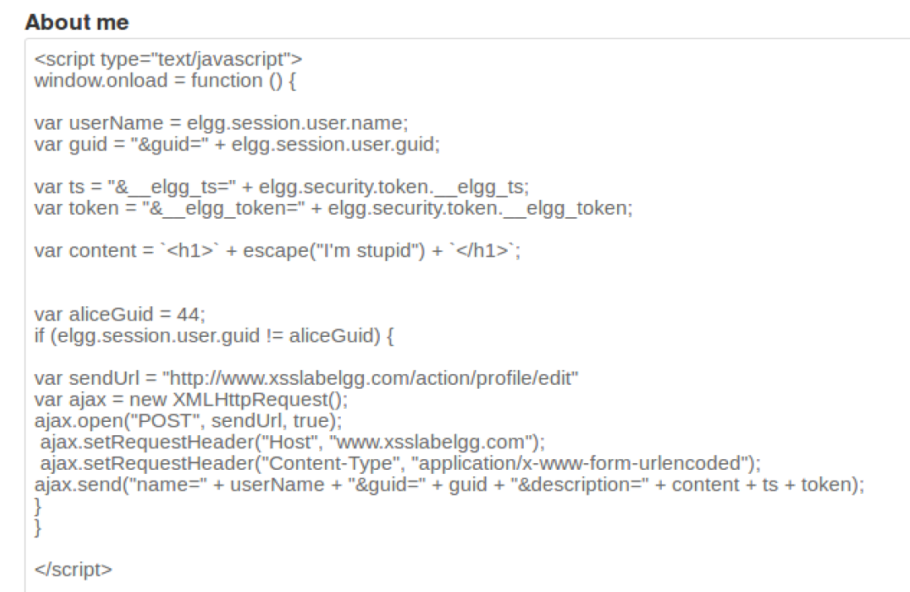

Before boby visiting Alice's profile:

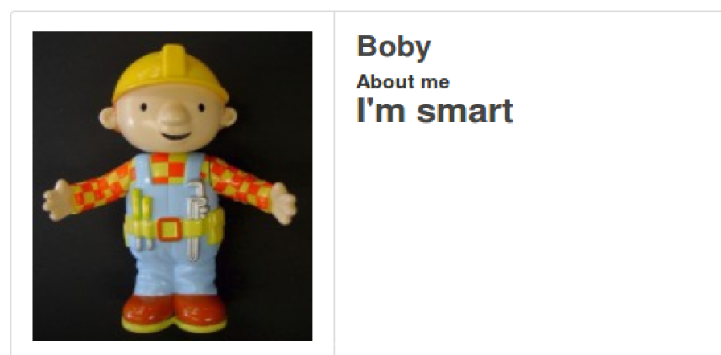

After visiting Alice's profile:

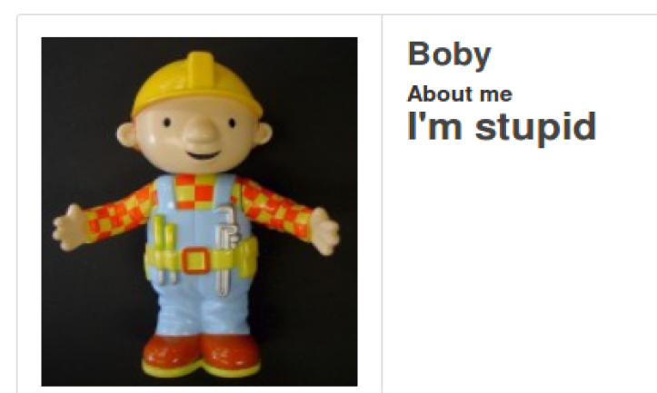

#### Questions. Please answer the following questions: 

- Question 3: Why do we need Line ➀? Remove this line, and repeat your attack. Report and explain your observation.

  It will accidently overwrite attacker's profile.

### Task 6: Writing a Self-Propagating XSS Worm

Samy change his profile to 

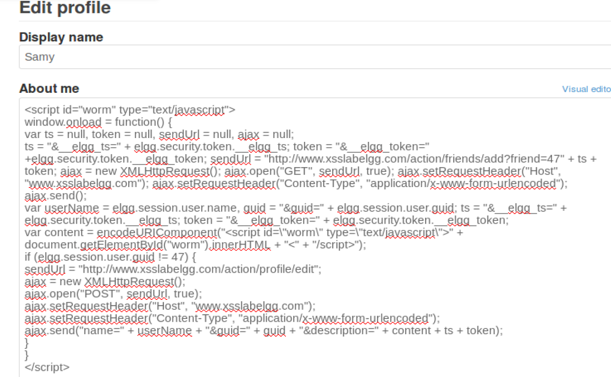

It's will make visitor Samy's friend and make visitor's profile a same copy as samy's profile.

Alice visits Samy's profile, and then Boby visits Alice's profile, which make Alice and Boby both Samy's friends.

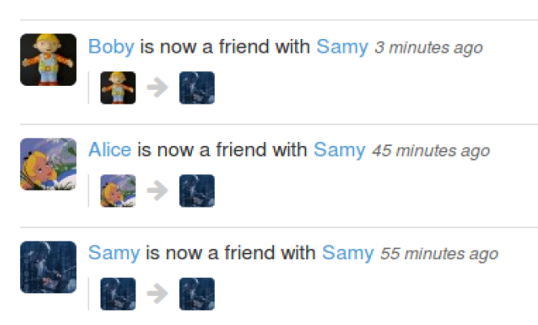

### Task 7: Countermeasures

`HTMLawed` is already activated, malicious code can be executed normally

`htmlspecialchars`, the malicious code is invalid because the script is now common text.

