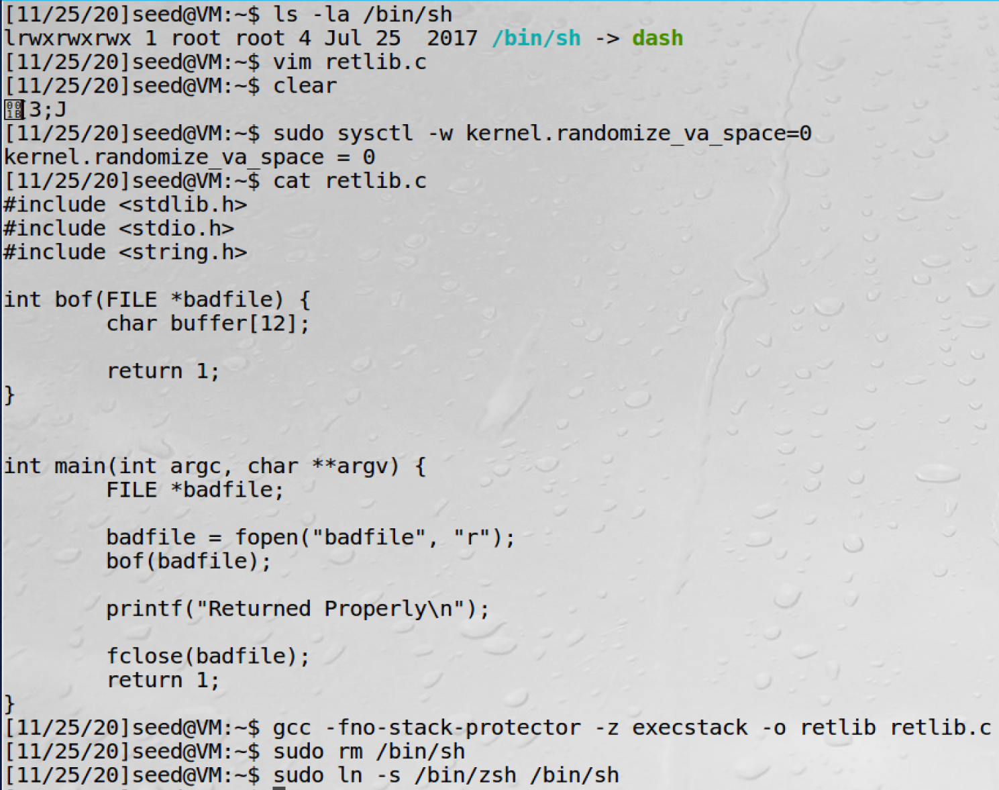
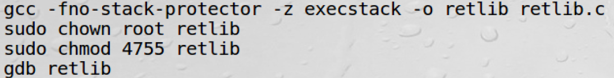
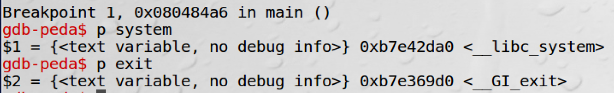
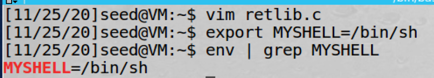
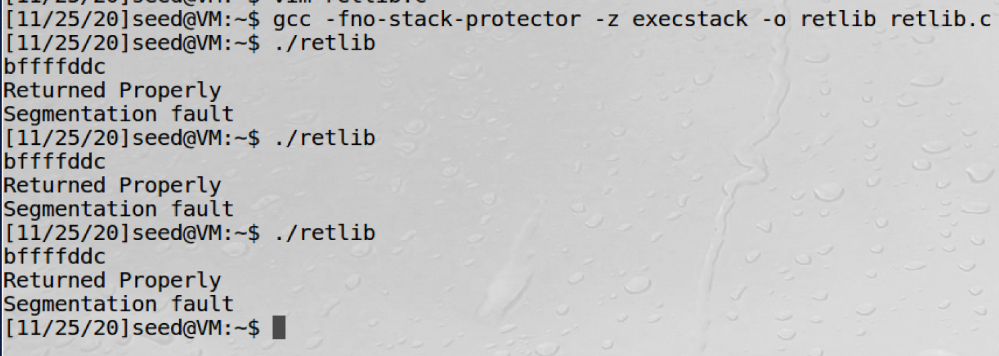
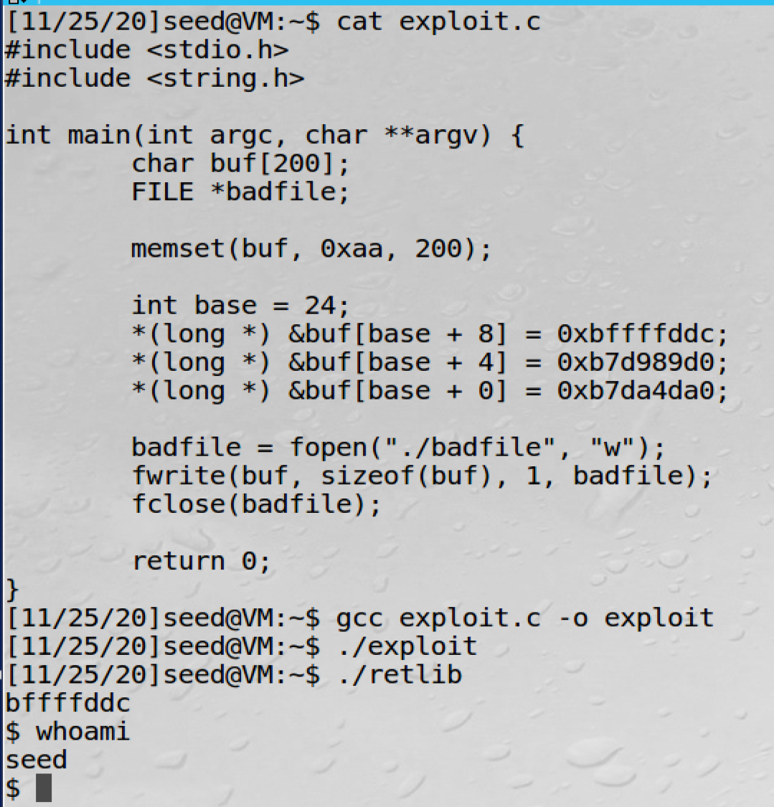
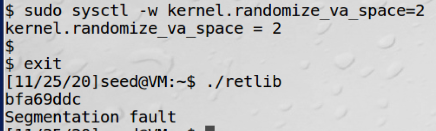
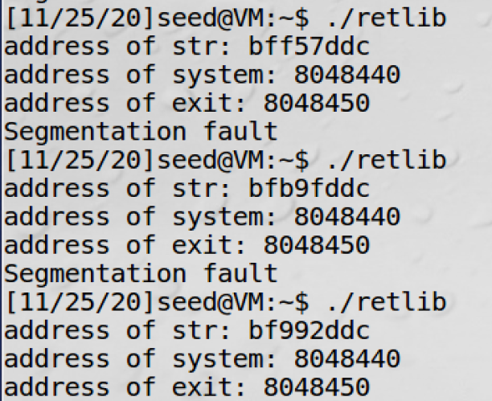

# Lab11 for CS315

## Some info...

Author: 11711918 吴烨昌

## Tasks

### Prework

### Task 1

address of `system`: `0xb7e42da0`

address of `exit`: `0xb7e369d0`

### Task 2

address of shell string: `0xbffffddc`

### Task 3

### Task 4

Attack failed. Retlib ends with segmentation fault.

The three addresses are all changed. And the address of env variable will be changed during every execution.

