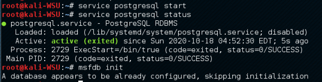

# Lab4 for CS315

## Some info...

Author: 11711918 吴烨昌

## Tasks

### Part 1

The target's IP is `192.168.198.133`

Use nmap to scan the target and find the software version of the OS

The software version of the OS is `Linux 2.6.9-2.6.33`

The running services (list at least 3 of the running services).

The target has services ssh(port 22), ftp (port 21), smtp (port 25) and so on.

What are the differences if we use T1, T2, T3 flags? 

T0, T1 is for IDS version. T1 waits for 15 seconds between sending each probe.

T2 slows down the can to use less bandwidth and target machine resources. T2 waits for 0.4 seconds between sending each probe.

T3 is the default behaviour.

How to avoid detection from an intrusion detection system (e.g., stealthy scanning)? 

Use `-T0` or `-T1`.

### Part 2

1. Read the lab instructions above and finish all the tasks

   

   

   

   

   

   Using UnreaIRCD IRC Daemon Backdoor to Attack

   

   

   Using Vsftpd v2.3.4 Backdoor to attack

   

   

   

   

   Using armitage

   

   

   

   

   

   

2. Why do we need to assign an internal IP address (i.e., behind NAT) for Metasploitable2-Linux? What will happen if we assign a public IP to it?

   Publishing a host with so many vulnerabilities will bring security problem. For example, use reverse shell to attack internal network hosts.

3. Besides the two vulnerabilities we used, exploit another vulnerability using both msfconsole and Armitage. Show me that you have placed a file in the exploited remote machine via screenshots and by creating the file with the command “touch ” where  should be replaced with your full name

   

   