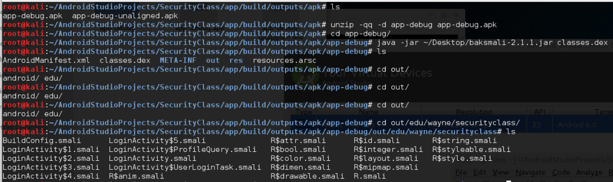
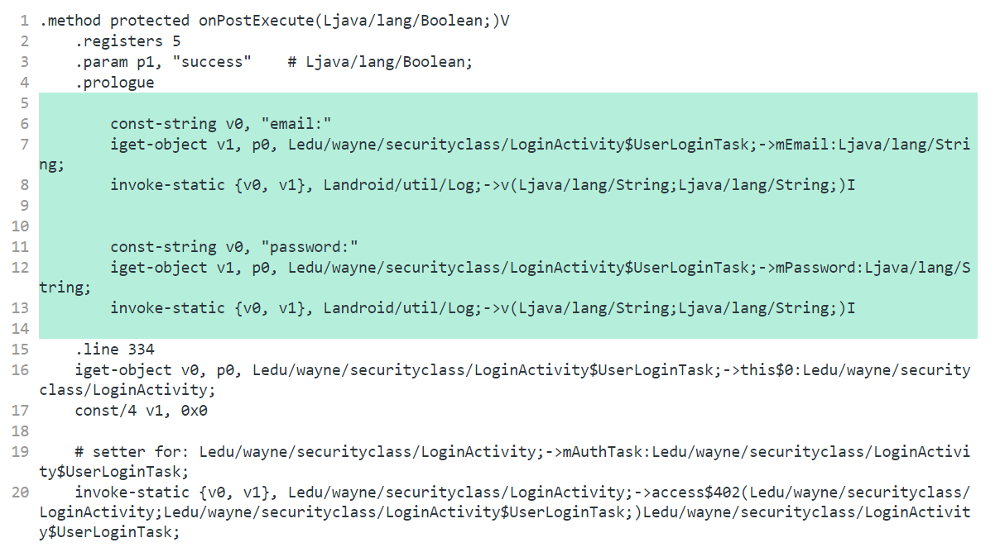
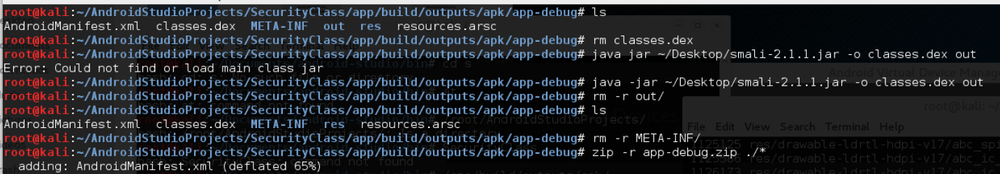
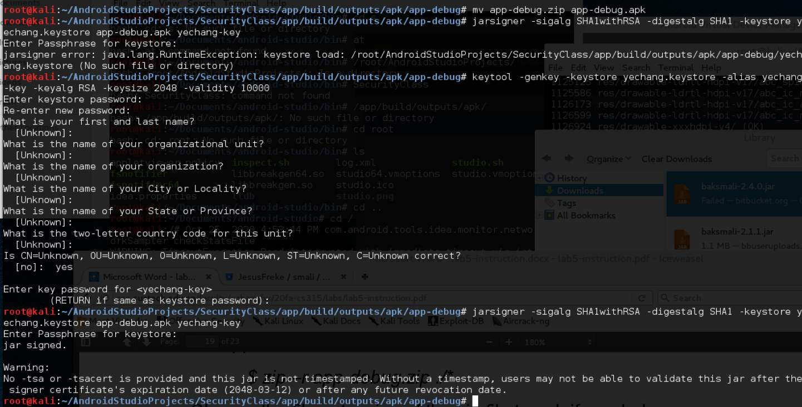
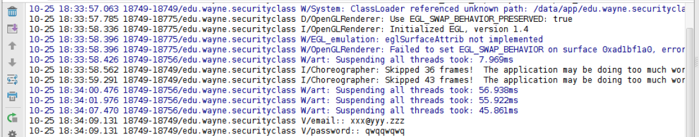
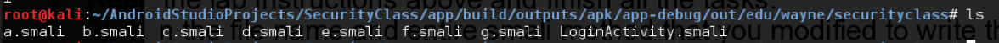
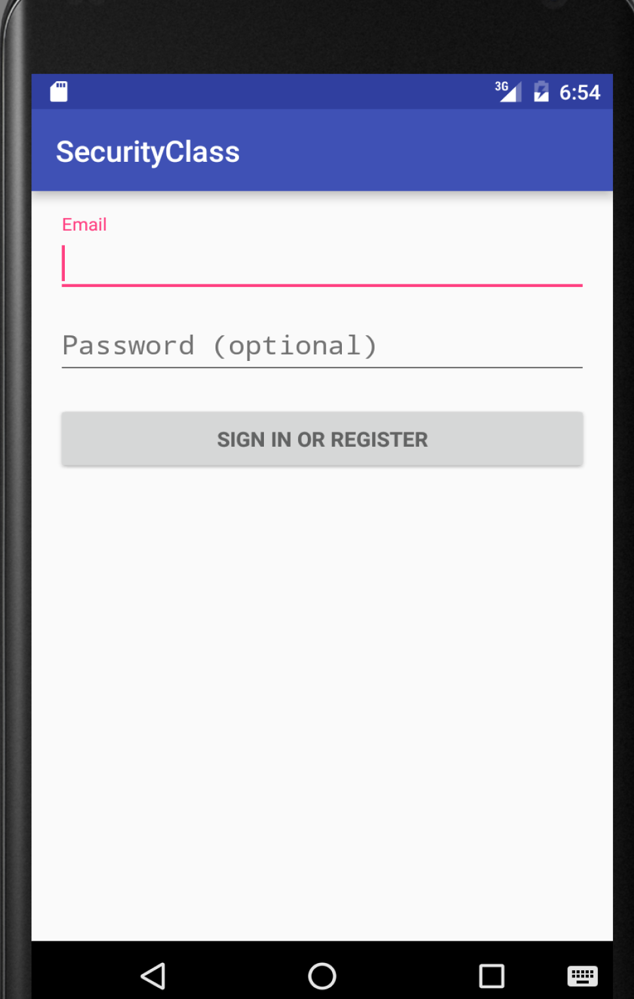

# Lab5 for CS315

## Some info...

Author: 11711918 吴烨昌

## Tasks

### Turn in the file name and entire smali method that you modified to write the username and password to the log from the Login App.



Convert `.apk` to `.smali`.

Then I modified method `onPostExecute`  in  `LoginActivity$UserLoginTask.smali`:



Repackage:



Resign:



Do sign in action and observe the log:




### Describe the process to obfuscate an Android 
#### What tools did you use?

ProGuard

#### Can you still repackage the application using baksmali or smali tool? Justify your answer.

Depack:



Repack and run:



Yes, I can still repackage the application using baksmali or smali tool, even though I modified the smali code.

### Acknowledge

#### Some helpful script

depack.sh

``` bash
unzip -qq -d app-debug app-debug.apk
cd app-debug
java -jar ~/Desktop/baksmali-2.1.1.jar classes.dex
```

repack.sh

``` bash
cd app-debug
rm classes.dex
java -jar ~/Desktop/smali-2.1.1.jar -o classes.dex out
rm -r out
rm -r META-INF
zip -qq -r app-debug.zip ./*
mv app-debug.zip app-debug.apk

jarsigner -sigalg SHA1withRSA -digestalg SHA1 -keystore ../yechang.keystore app-debug.apk yechang-key

/root/Android/Sdk/build-tools/23.0.2/zipalign -v 4 app-debug.apk app-debug-aligned.apk

mv app-debug-aligned.apk app-debug.apk
```

run.sh

``` bash
cd app-debug
adb uninstall edu.wayne.securityclass
adb install app-debug.apk
```

