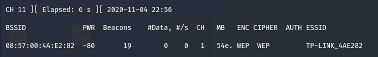
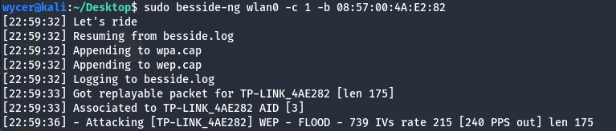
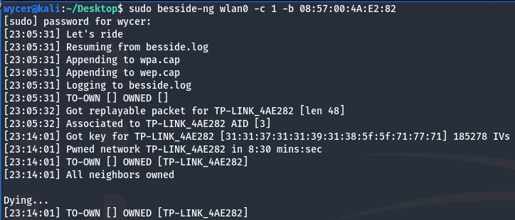
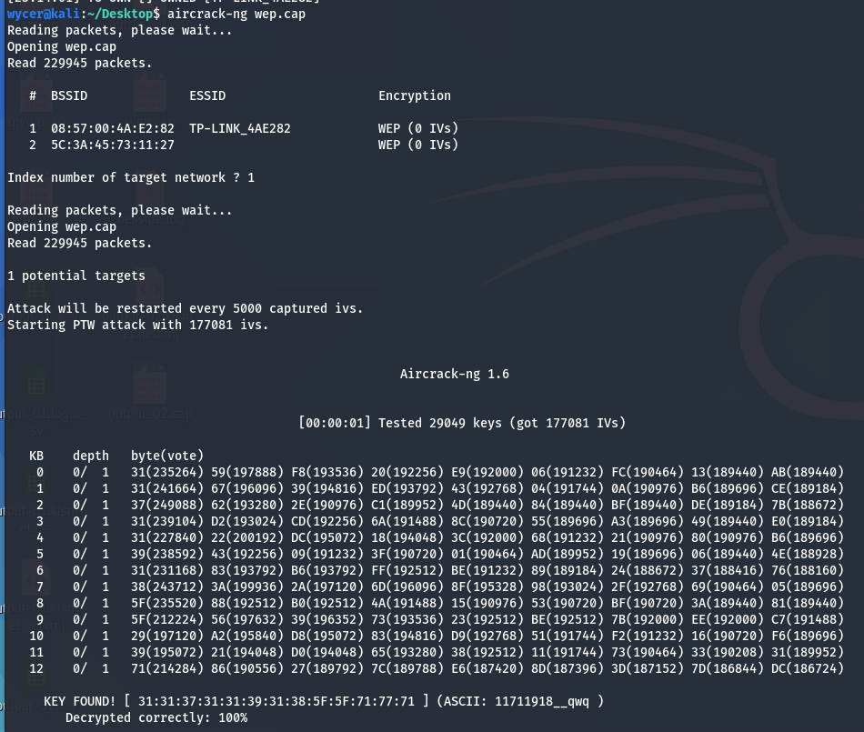

# Lab6 for CS315

## Some info...

Author: 11711918 吴烨昌

## Tasks

### Part 1


1. Read the lab instructions above and finish all the tasks.

2. Answer the questions in the Introduction section, and justify your answers.
    Simple yes or no answer will not get any credits.


  1. What security features does Zephyr have?

        1. RO/NX memory protectons
        2. Stack depth overfow preventon
        3. Stack bufer overfow detecton
        4. Kernel code considered trusted
        5. Userspace threads, not processes
        6. Kernel/user boundary stll being fully feshed out
        7. (Generally) Sing le applicaton
        8. Highly dependent on partcular SoC, confg , applicaton developer

  2. Do applications share the same address space with the OS kernel?

     Yes, but it also supports to share same address space (for platforms without MMU/MPU and memory constrained devices,)

  3. Does Zephyr have defense mechanisms such as non-executable stack or Address Space Layout Randomization (ASLR)?

     I am not sure whether zephyr has non-executable stack or not but zephyr has implemented an identity page table that is helpful to support non-executable stack. There is no ASLR in Zephyr.

  4. Do textbook attacks (e.g., buffer overflow or heap spray) work on Zephyr?

     Yes, buffer overflow works.

3. Change the EIP register to the value 0xdeadbeef, and show me the screenshot
    of the EIP value when the application crashes.

  

### Part 2

1. Read the lab instructions above and finish all the tasks.

2. Answer the questions in the Introduction section, and justify your answers.

   1. What is the difference between Monitor Mode and Promiscuous Mode?

      1. Monitor mode only applies to wireless networks, while promiscuous mode can be used on both wired and wireless networks. 
      2. Promiscuous mode allows you to view all wireless packets on a network to which you have associated. But in monitor mode, you can see packets you have not even associated. 
      3. Promiscuous mode tells the card to process all frames, (i.e. remove 802.11 frame headers ) including those not destined for it. But, monitor mode tells the card to pass along the frames intact (with 802.11 headers) and not present Ethernet frames to the host.

   2. What lessons we learned from this lab about setting the WiFi password?

      DO **NOT** USE WEP.

      DO **NOT** USE COMMON WORDS.

3. Change your router to a different passphrase, and use the Wireshark and Aircrach-ng to crack the passphrase. Show screenshots of the result.

   ``` bash
   sudo airodump-ng wlan0 --encrypt wep
   ```
   
   
   
   The BSSID is `08:57:00:4A:E2:82`, ESSID is `TP-LINK_4AE282`, channel is 1.
   
   Then, use besside-ng to crack the password.
   
   ``` bash
   sudo besside-ng wlan0 -c 1 -b 08:57:00:4A:E2:82
   ```
   
   
   
   (The target machine is watching an online 4k video to generate a lot of packets.)
   
   
   
   Then, try to find `wep.cap`
   
   ``` bash
   aircrack-ng wep.cap
   ```
   
   
   
   Oh hoo, the password is `11711918__qwq`. It's the correct password for the target WiFi.

