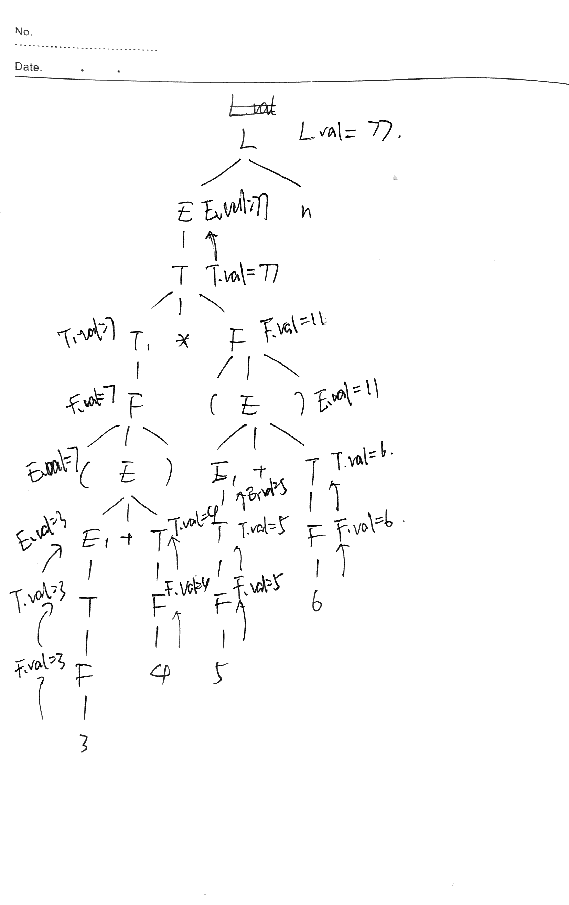
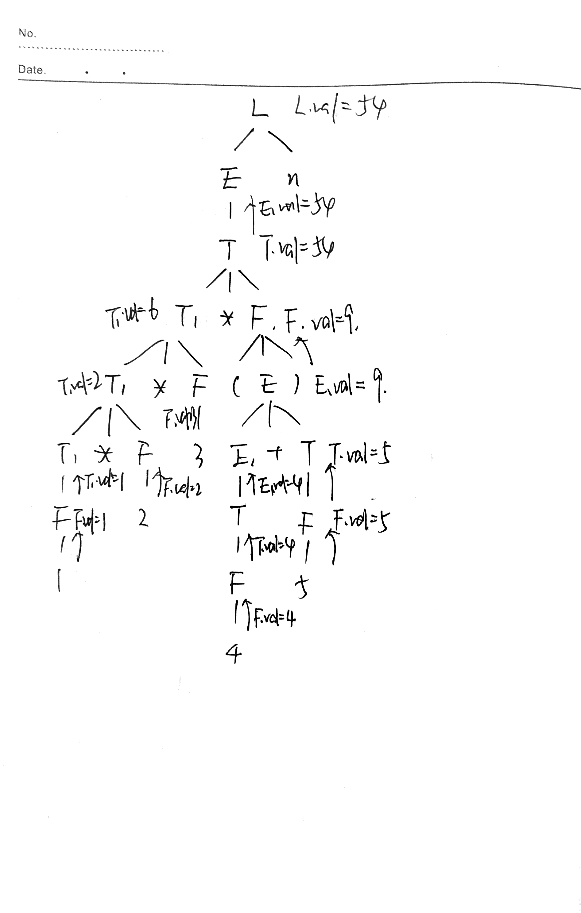

### Exercise 1

### Exercise 2

What are all the topological sorts for the dependency graph of Figure 2? One sort mentioned during lecture is 1, 2, 3, . . . , 9 (slide #16 of Chapter 4). [20 points]

- `2, 4, 1, 3, 5, 6, 7, 8, 9`
- `2, 1, 4, 3, 5, 6, 7, 8, 9`
- `2, 1, 3, 4, 5, 6, 7, 8, 9`
- `2, 1, 3, 5, 4, 6, 7, 8, 9`
- `1, 2, 4, 3, 5, 6, 7, 8, 9`
- `1, 2, 3, 4, 5, 6, 7, 8, 9`
- `1, 2, 3, 5, 4, 6, 7, 8, 9`
- `1, 3, 2, 4, 5, 6, 7, 8, 9`
- `1, 3, 2, 5, 4, 6, 7, 8, 9`
- `1, 3, 5, 2, 4, 6, 7, 8, 9`

### Exercise 3

| Production                    | Semantic Rules                                             |
| ----------------------------- | ---------------------------------------------------------- |
| $E → E + T$                   | $E.type = E.type == float || T.type == float ? float :int$ |
| $E \rightarrow T$             | $E.type = T.type$                                          |
| $T → \text{num} . \text{num}$ | $T.type = float$                                           |
| $T \rightarrow \text{num}$    | $T.type = int$                                             |

