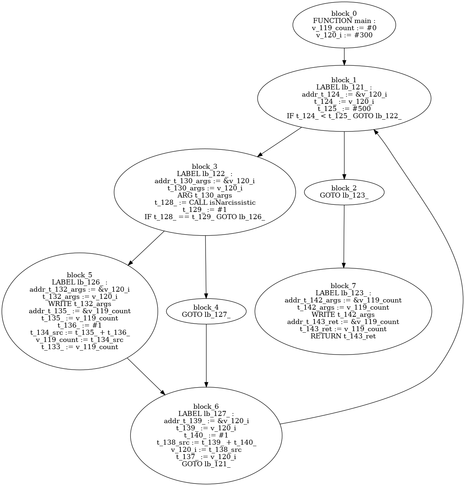
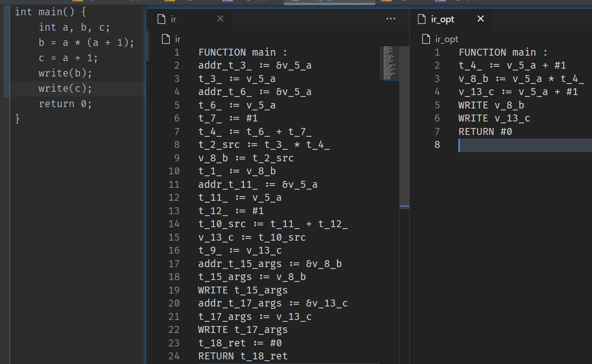
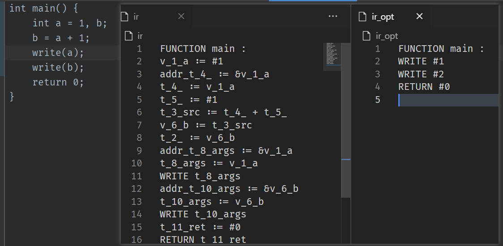
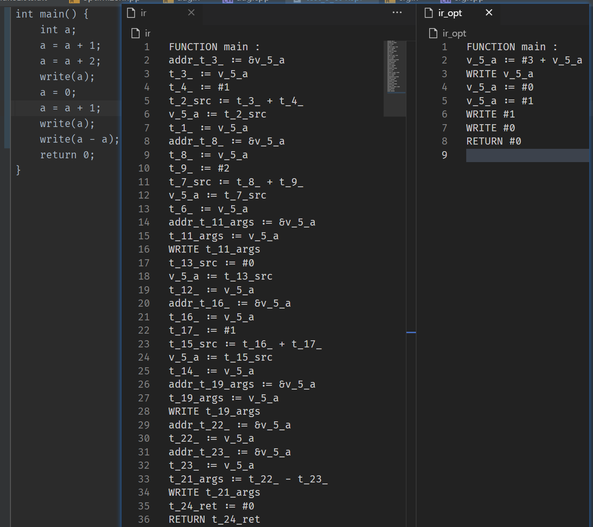
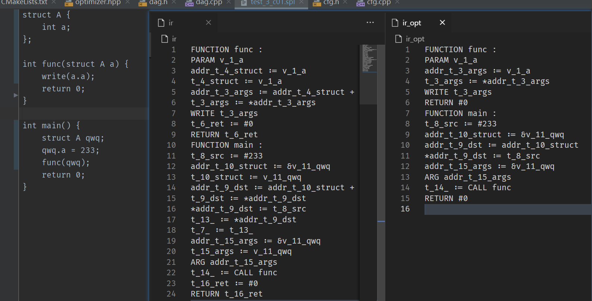

# Report2 for CS323

## Some info...

Author: 11711918 吴烨昌

## Design and Implementation

### Basic Part 

In order to realize the transmission of grammatical information, I refactor the project structure so that all the AST nodes generated from different production has different `struct ` but not one-time function.

For example, the constructor will generate a node with type `Args`. Fields from this `Args` production will be collected from its children nodes as its member variables.

``` c++
struct Args {
    std::vector<Field *> fields; 	// Record information from children nodes. 
    std::vector<std::string> tags;

    Args *nextArgs = nullptr;			
    Exp *exp;
    explicit Args(Node *node) { ... }
    IRList generate();
};
```

####  IR

I design a basic abstract class `IR`. All IR type has their own struct. It helps to construct IR code.

``` c++
struct IR {
    std::vector<std::string> args;
    IRType irType;
    IR(std::vector<std::string> args, IRType type) {...}
    virtual std::string str() { ... };
};

struct FUNCTION_IR : public IR {
    std::string function_name;
    FUNCTION_IR(std::vector<std::string> args) : IR(args, IRType::IR_FUNCTION) { ... }
    virtual std::string str() { ... }
};
```

Then call `program->generate()` to get IR. (`program` is guaranteed to be the entry)

## Optimization

1. Separate original result IR list by `FUNCTION`s,`LABEL`s, `GOTO`s to construct CFG and DAG.

   For example, here is a picture generated by my compiler with `graphviz dot`.

   

2. Inner block: 
   1. common sub expression
   2. a simple algebraic optimization
   3. const compression
   4. copy propagation

3. Inter blocks:

   1. dead code elimination

### Explanation



(common sub expression) compiler will recognize that a is constant so that `v_13_c` is regard as a copy of `t_4_` (a + 1), and then `v_13_c` will be assigned with `t_4_`. Then compiler change it to `v_13_c := v_5_a + #1` for providing possibility for further optimization.



(const compression) compiler will recognize that a is constant so that `v_1_a` is regard as a copy of `#1`, and then `v_6_b` will be regard as `#2`. 

(copy propagation) compiler find that `WRITE t_10_args` and `t_10_args := v_6_b`, let `t_10_args = #2`.

(dead code elimination) compiler find that some names are modified but has no further usage. Then compiler will remove them.



(a simple algebraic optimization) compiler will recognize `a - a = #0` and compress "a = a + 1; a = a + 2;" to `a = a + 3`;

### Result

Some results of standard tests. 

|                      Test                       | Total instructions |
| :---------------------------------------------: | :----------------: |
|             test_3_r03.spl (Prime)              |        3685        |
|      test_3_r09.spl (Narcissistic number)       |       33411        |
| test_3_b02.sql (quick sort for 8,7,6,5,4,3,2,1) |        966         |

## Bonus

Array and struct as function argument.



